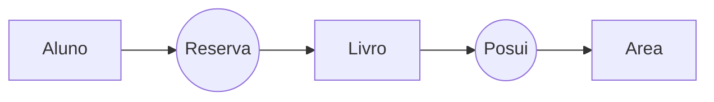

# Sobre

Trabalho desenvolvido pra disciplina de Linguagem de Programação II e Banco de Dados II do curso Técnico de Desenvolvimento de Sistemas do Campus IFSUL-CAVG. O objetivo do trabalho era o desenvolvimento de um sistema de gerenciamento para uma biblioteca fictícia, baseado nos requisitos apresentados pelo professor da  disciplina

### Como Usar
O trabalho foi feito utilizando PHP, MySQL, HTML, CSS e JS. Recomenda-se da utilização de um pacote de servidor que utilize tais linguagens, nesse caso o [XAMPP](https://www.apachefriends.org/pt_br/index.html) (ou similar a depender do seu OS).

## Estrutura de Arquivos
Pasta Raiz
>**BD** 
>> SQL IMPORT.sql -> Importação direta da Base de Dados  
>> SQL INSTRUCTIONS.txt -> Comandos para a montagem da BD  
>
>**WEB**
>> **cadastros** -> Contem as paginas de cadastro de entidades  
>>**edicao** -> Contem as paginas de edição/exclusão das entidades  
>> **JS** -> Contem os arquivos em JavaScript  
>> **listas** -> Contem as paginas de visualização de entidades  
>
>conectar.php ->Ligação de todos arquivos com o BD  
>estilo.css -> Estilo das paginas  
>index.php -> Pagina de login  
>main.php -> Pagina de HUB para as funções  

## Primeiro Uso
Não esqueça de cadastrar um aluno diretamente no BD para conseguir fazer o login e poder fazer o CRUD das demais entidades diretamente no sistema.

## Modelo Conceitual BD

#### Tabela com tipagem e atributos
Chave Primaria - #  
Chave Estrangeira - @
- Aluno

|Nome do campo| Tipo de dados| Restrição de integridade e comentários|
|-|-|-|  
|#matricula| Auto_increment| not null  
|nome| varchar (50)| not null  
|email| varchar (50)| not null  
|cpf| char(11)| not null  
|data_nasc| Date| not null

- Livro

|Nome do campo| Tipo de dados| Restrição de integridade e comentários
|--|--|--|
|#id| Auto_increment| not null  
|titulo| varchar (50)| not null  
|status| boolean| not  null  –  0: Emprestado  / 1: Disponível  
|autor| varchar (50)| not null  
|@id_area| integer| not null  –  Código da  área de conhecimento(Computação,Matemática, Engenharia)

- Area

|Nome do campo| Tipo de dados| Restrição de integridade e comentários
|--|--|--|  
|#id| Auto_increment| not null  
|nome| varchar (50)| not null

- Reserva

|Nome do campo| Tipo de dados| Restrição de integridade e comentários
|--|--|--|  
|#id| Auto_increment| not null  
|@matricula| integer| not null  –  Matrícula  do  aluno  
|@id_livro| integer| not null  –  Código do  livro  
|data_retirada| date| not null  
|data_entrega| date| not null  
|status| boolean| not null  –  0: Encerrada / 1: Em aberto

### Licença de Código
GNU General Public License v3.0
